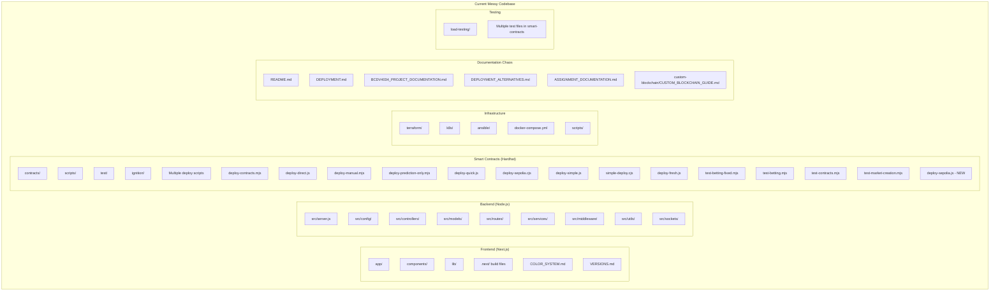
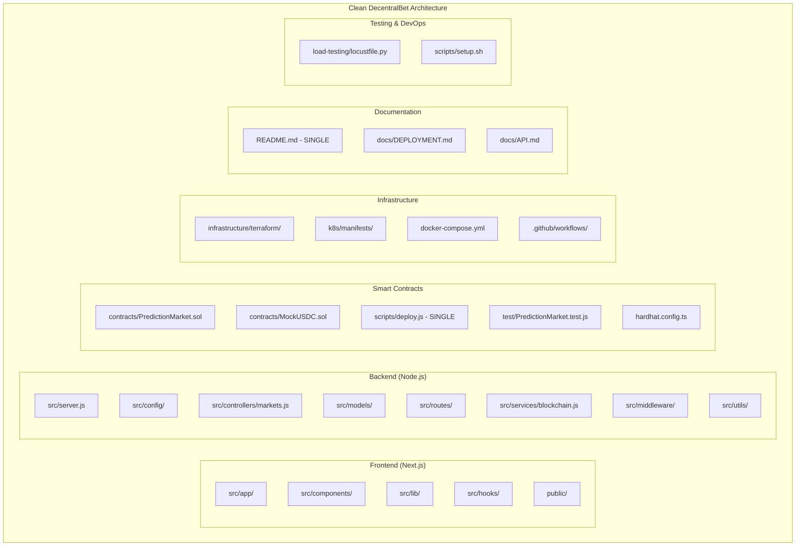

# DecentralBet Architecture Analysis & Cleanup Plan

## Current Codebase Analysis



## Issues Identified

### 🚨 **Major Problems:**

1. **Smart Contracts - 15+ Deployment Scripts!**
   - `deploy-contracts.mjs`
   - `deploy-direct.js` 
   - `deploy-manual.mjs`
   - `deploy-prediction-only.mjs`
   - `deploy-quick.js`
   - `deploy-sepolia.cjs`
   - `deploy-simple.js`
   - `simple-deploy.cjs`
   - `deploy-fresh.js`
   - `deploy-sepolia.js` (new one we just added)
   - Multiple test files doing similar things

2. **Documentation Bloat - 6 Different README/DOC Files**
   - Multiple overlapping documentation files
   - Redundant explanations
   - Inconsistent information

3. **Unused Frontend Files**
   - `.next/` build directory committed (should be in .gitignore)
   - `COLOR_SYSTEM.md` and `VERSIONS.md` (unnecessary)
   - Build artifacts in repo

4. **Backend Structure Issues**
   - Mixed naming conventions
   - Some unused routes and controllers
   - Election vs Market vs Prediction confusion

## Clean Architecture Plan



## Cleanup Tasks

### ✂️ **Files to DELETE:**

#### Smart Contracts (Remove 90% of deployment scripts):
- `deploy-contracts.mjs`
- `deploy-direct.js`
- `deploy-manual.mjs`
- `deploy-prediction-only.mjs`
- `deploy-quick.js`
- `deploy-sepolia.cjs`
- `deploy-simple.js`
- `simple-deploy.cjs`
- `deploy-fresh.js`
- `test-betting-fixed.mjs`
- `test-betting.mjs`
- `test-contracts.mjs`
- `test-market-creation.mjs`

#### Documentation (Keep only essential):
- `DEPLOYMENT_ALTERNATIVES.md`
- `ASSIGNMENT_DOCUMENTATION.md`
- `VERSIONS.md`
- `COLOR_SYSTEM.md`

#### Frontend Build Files:
- Entire `.next/` directory
- Build artifacts

#### Backend Cleanup:
- Remove unused Election-related files
- Consolidate voting/prediction/market concepts

### 🏗️ **Files to KEEP & CONSOLIDATE:**

#### Smart Contracts:
- `contracts/PredictionMarket.sol` ✅
- `contracts/MockUSDC.sol` ✅
- `scripts/deploy.js` (consolidated single deployment script) ✅
- `test/PredictionMarket.test.js` ✅
- `hardhat.config.ts` ✅

#### Core Application:
- Frontend: Clean Next.js structure
- Backend: Focused on prediction markets only
- Single deployment pipeline

#### Infrastructure:
- Terraform modules ✅
- Kubernetes manifests ✅
- GitHub Actions CI/CD ✅

### 📋 **Consolidation Strategy:**

1. **Single Purpose**: Focus only on prediction markets, remove election/voting confusion
2. **One Deploy Script**: Merge all deployment logic into one configurable script
3. **Clean Documentation**: One comprehensive README
4. **Consistent Naming**: PredictionMarket everywhere, no more Election/Voting mix
5. **Remove Build Artifacts**: Proper .gitignore

## Target Clean Structure:

```
decentralbet-bcdv4034/
├── README.md                          # Single comprehensive README
├── docker-compose.yml                 # Local development
├── .env.example                       # Environment template
│
├── frontend/                          # Next.js app
│   ├── src/app/                      # App router
│   ├── src/components/               # Reusable components
│   ├── src/lib/                      # Utilities
│   └── package.json
│
├── backend/                           # Node.js API
│   ├── src/server.js                 # Main server
│   ├── src/controllers/              # Route handlers
│   ├── src/models/                   # Database models
│   ├── src/services/                 # Business logic
│   └── package.json
│
├── smart-contracts/                   # Blockchain layer
│   ├── contracts/                    # Solidity contracts
│   ├── scripts/deploy.js            # SINGLE deploy script
│   ├── test/                         # Contract tests
│   └── hardhat.config.ts
│
├── infrastructure/                    # DevOps
│   ├── terraform/                    # Infrastructure as Code
│   ├── k8s/                         # Kubernetes manifests
│   └── ansible/                      # Configuration management
│
├── load-testing/                      # Performance testing
│   └── locustfile.py
│
└── docs/                             # Additional documentation
    ├── DEPLOYMENT.md
    └── API.md
```

This reduces the project from 70+ JavaScript/TypeScript files to ~25 focused, clean files.
