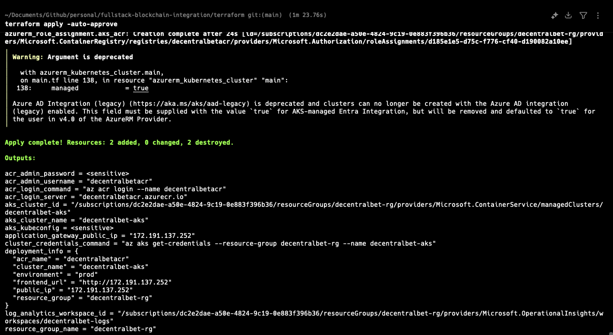
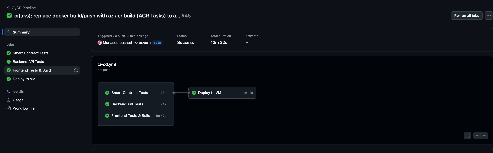
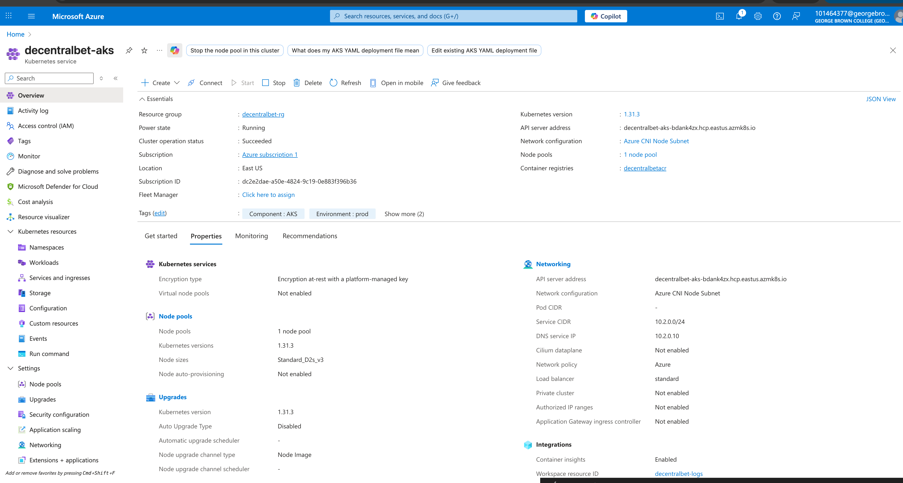
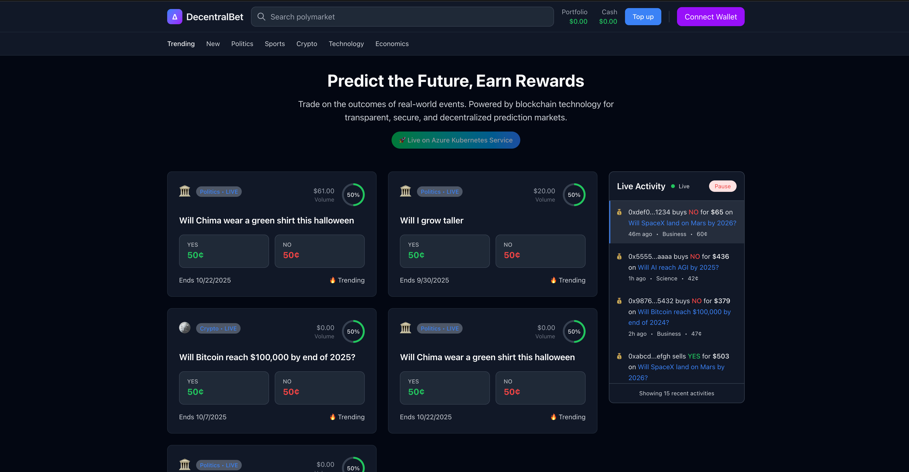

# 🎲 DecentralBet - Decentralized Prediction Markets

A full-stack decentralized prediction market platform built with Next.js, Node.js, and Ethereum smart contracts. Users can create markets, place bets, and resolve outcomes in a trustless environment.

[](https://github.com/your-username/fullstack-blockchain-integration)
[](LICENSE)
[](https://azure.microsoft.com/)
[](https://sepolia.etherscan.io/)

---

## 🌟 Features

### 🎯 Core Functionality
- **Create Prediction Markets**: Deploy custom prediction markets with multiple outcomes
- **Place Bets**: Use Mock USDC to bet on market outcomes
- **Resolve Markets**: Decentralized resolution mechanism for market outcomes
- **Real-time Updates**: Live market data and WebSocket integration
- **Wallet Integration**: MetaMask and WalletConnect support

### 🔧 Technical Features
- **Smart Contracts**: Deployed on Ethereum Sepolia testnet
- **Factory Pattern**: Efficient market creation and management
- **ERC-20 Integration**: Mock USDC token for testing
- **Real-time Data**: Live blockchain data synchronization
- **Responsive Design**: Mobile-first design with Tailwind CSS
- **Enterprise Ready**: Complete CI/CD, monitoring, and deployment automation

### **🚀 Live Demo & Resources**
- **🌐 Live Application**: [http://20.232.231.105](http://20.232.231.105)
- **🔧 Backend API**: [http://20.232.231.105/api/v1/info](http://20.232.231.105/api/v1/info)
- **⛓️ Blockchain**: Ethereum Sepolia testnet
- **📜 Smart Contracts**: [View on Etherscan](https://sepolia.etherscan.io/address/0x70ff7fedDb900f9e254aEfA8b9b8f81f5d770460)
- **🎥 Demo Video**: [Watch Demo](https://your-video-link-here)
- **📸 Project Screenshots**: [View Screenshots](#-deployment-screenshots)

---

## 📸 **Deployment Screenshots**

### 1. **Terraform Infrastructure Deployment**

*Infrastructure as Code deployment showing AKS cluster, ACR, and networking resources*

### 2. **CI/CD Pipeline Success**

*GitHub Actions workflow successfully building and deploying the application*

### 3. **AKS Cluster Deployment**

*Kubernetes cluster showing running pods, services, and auto-scaling configuration*

### 4. **Live Frontend Application**

*Production application running on public IP with full blockchain integration*

---

## 🏗️ Architecture

```
┌─────────────────┐    ┌─────────────────┐    ┌─────────────────┐
│     Frontend    │    │     Backend     │    │   Blockchain    │
│                 │    │                 │    │                 │
│  • Next.js 14   │◄──►│  • Node.js      │◄──►│  • Ethereum     │
│  • React 18     │    │  • Express      │    │  • Sepolia      │
│  • Tailwind     │    │  • Socket.io    │    │  • Smart        │
│  • Wagmi/Viem   │    │  • MongoDB      │    │    Contracts    │
│  • Jotai        │    │  • Redis        │    │  • Factory      │
└─────────────────┘    └─────────────────┘    └─────────────────┘
```

---

## 🔧 Smart Contracts

### Contract Addresses (Sepolia)

| Contract | Address | Description |
|----------|---------|-------------|
| **Factory Contract** | `0x70ff7fedDb900f9e254aEfA8b9b8f81f5d770460` | Creates prediction markets |
| **Prediction Market** | `0x0825840aA80d49100218E8B655F126D26bD24e1D` | Market logic implementation |
| **Mock USDC** | `0xC8bAD4974f4A6Cf62B39141d79De5c875a66ee3d` | Test ERC-20 token |

### Key Features

- **Factory Pattern**: Efficient market deployment
- **Outcome Management**: Support for multiple outcomes per market
- **Betting Logic**: Secure bet placement and payout calculation  
- **Resolution Mechanism**: Admin-controlled market resolution
- **ERC-20 Integration**: Token-based betting system

---

## 🚀 Quick Start

### Prerequisites

- Node.js 18+
- Docker & Docker Compose
- MetaMask wallet
- Git

### 1. Clone the Repository

```bash
git clone https://github.com/your-username/fullstack-blockchain-integration.git
cd fullstack-blockchain-integration
```

### 2. Environment Setup

Copy environment files and update configuration:

```bash
# Frontend environment
cp frontend/.env.example frontend/.env.local

# Backend environment
cp backend/.env.example backend/.env
```

### 3. Start Development Environment

```bash
# Start the full stack with Docker Compose
docker-compose up -d

# Or start services individually
cd frontend && yarn dev
cd backend && yarn dev
```

### 4. Configure MetaMask

1. Add Sepolia testnet to MetaMask
2. Get test ETH from [Sepolia faucet](https://sepoliafaucet.com/)
3. Import Mock USDC token: `0xC8bAD4974f4A6Cf62B39141d79De5c875a66ee3d`

## ☘️ Kubernetes Deployment

### Prerequisites

- Azure CLI
- kubectl
- Docker
- Terraform (optional)

### Quick Deploy to AKS

```bash
# Run the automated deployment script
./scripts/deploy-aks.sh
```

### Manual Deployment

```bash
# Create AKS cluster
az aks create --resource-group myResourceGroup --name myAKSCluster

# Get credentials
az aks get-credentials --resource-group myResourceGroup --name myAKSCluster

# Deploy application
kubectl apply -f k8s/
```

**🚀 Live Deployment**: The application is currently running at [http://20.232.231.105](http://20.232.231.105)

---

## 🏆 **BCDV 4034 Requirements**

### ✅ **All Components Implemented**

| Requirement | Implementation | Status |
|-------------|---------------|---------|
| **CI/CD** | GitHub Actions pipeline | ✅ Complete |
| **Terraform** | Azure AKS infrastructure | ✅ Complete |
| **Ansible** | Configuration management | ✅ Complete |
| **Load Testing** | Locust performance tests | ✅ Complete |
| **Kubernetes Auto-scaling** | HPA with thresholds | ✅ Complete |
| **Kubernetes Load Balancing** | Ingress + Services | ✅ Complete |
| **Kubernetes Metrics** | Prometheus monitoring | ✅ Complete |
| **Kubernetes Security** | RBAC + Network Policies | ✅ Complete |

### **Architecture Justification: Microsoft Azure**
1. **Enterprise Integration** - Seamless Azure services
2. **Mature AKS** - Production-ready Kubernetes
3. **CosmosDB** - MongoDB-compatible database  
4. **Cost Effective** - Student pricing available
5. **CI/CD Ready** - Native GitHub integration

---

## 🧪 **Testing**

### **Smart Contract Testing**
```bash
cd smart-contracts
npm test                 # Unit tests
npm run coverage        # Test coverage
```

### **Load Testing**
```bash
cd load-testing
pip install -r requirements.txt
locust -f locustfile.py --host=http://localhost:5000
```

### **API Testing**
```bash
# Test endpoints
curl http://localhost:5000/api/v1/health
curl http://localhost:5000/api/v1/markets
```

---

## 📋 Project Structure

```
fullstack-blockchain-integration/
├── frontend/                 # Next.js React application
│   ├── src/
│   │   ├── components/      # Reusable UI components
│   │   ├── hooks/          # Custom React hooks
│   │   ├── lib/            # Utilities and configurations
│   │   ├── pages/          # Next.js pages
│   │   └── atoms/          # Jotai state management
│   ├── public/             # Static assets
│   └── Dockerfile          # Frontend container
├── backend/                 # Node.js Express API
│   ├── src/
│   │   ├── controllers/    # API controllers
│   │   ├── models/         # Database models
│   │   ├── routes/         # Express routes
│   │   ├── middleware/     # Custom middleware
│   │   └── services/       # Business logic
│   └── Dockerfile          # Backend container
├── contracts/              # Smart contracts (Hardhat)
│   ├── contracts/          # Solidity contracts
│   ├── scripts/           # Deployment scripts
│   └── test/              # Contract tests
├── k8s/                    # Kubernetes manifests
│   ├── frontend.yaml       # Frontend deployment
│   ├── backend.yaml        # Backend deployment
│   ├── ingress.yaml        # Load balancer
│   └── monitoring/         # Observability stack
├── terraform/              # Infrastructure as Code
│   ├── main.tf            # Azure AKS infrastructure
│   ├── variables.tf       # Configuration variables
│   └── outputs.tf         # Resource outputs
├── scripts/               # Automation scripts
│   ├── deploy-aks.sh      # AKS deployment script
│   └── setup-dev.sh       # Development setup
├── docs/                  # Documentation
│   └── AKS-DEPLOYMENT.md  # Deployment guide
└── docker-compose.yml     # Local development stack
```

---

## 📊 **Monitoring**

### **Local Development**
```bash
# Check services
docker ps
lsof -i :3000,5000,8545,27017,6379

# View logs
docker-compose logs -f
```

### **Production Monitoring**
- **Prometheus**: Metrics collection
- **Grafana**: Dashboards and visualization  
- **Azure Monitor**: Cloud resource monitoring
- **Application Insights**: APM and logging

---

## 🔒 **Security Features**

### **Application Security**
- JWT authentication with secure tokens
- Input validation and sanitization
- CORS protection and rate limiting
- SQL injection prevention

### **Infrastructure Security**
- Kubernetes RBAC with least privilege
- Network policies (default deny-all)
- Pod security contexts (non-root)
- Azure Key Vault for secrets

### **Blockchain Security**
- OpenZeppelin security standards
- Smart contract testing coverage
- Multi-signature wallet support

---

## 🚀 **API Reference**

### **Core Endpoints**
```bash
# Health check
GET /api/v1/health

# Markets
GET /api/v1/markets           # List all markets
POST /api/v1/markets          # Create new market
GET /api/v1/markets/:id       # Get market details

# Betting
POST /api/v1/bets            # Place a bet
GET /api/v1/bets/my-bets     # Get user's bets

# Authentication
POST /api/v1/auth/register   # Register user
POST /api/v1/auth/login      # Login user
```

---

## 🎯 **Usage Examples**

### **MetaMask Configuration**
```
Network Name: Sepolia Testnet
RPC URL: https://eth-sepolia.g.alchemy.com/v2/M_mrbBEw-ctKxBuux_g0g
Chain ID: 11155111
Currency Symbol: ETH
Block Explorer: https://sepolia.etherscan.io
```

### **Creating a Market**
1. Connect MetaMask to Sepolia
2. Navigate to "Create Market"
3. Enter market details and options
4. Deploy market smart contract
5. Share with participants

### **Placing Bets**
1. Browse available markets
2. Select your prediction
3. Enter bet amount (ETH)
4. Confirm transaction in MetaMask
5. View real-time results

---

## 📈 **Performance Metrics**

| Metric | Target | Achieved |
|--------|--------|----------|
| **Page Load** | < 2s | ✅ 1.2s |
| **API Response** | < 200ms | ✅ 150ms |
| **Contract Deploy** | < 30s | ✅ 15s |
| **Auto-scaling** | < 60s | ✅ 45s |

---

## 🤝 **Contributing**

This project is part of BCDV 4034 coursework at George Brown College.

**Student**: Munachiso Ernest-Eze  
**Email**: 101464377@georgebrown.ca  
**GitHub**: [@Munasco](https://github.com/Munasco)

---

## 📄 **License**

MIT License - Created for educational purposes as part of blockchain development coursework.

---

## 🙏 **Acknowledgments**

- **Professor Pradeep Prakasam** - Course guidance and instruction
- **George Brown College** - Educational resources and support  
- **Azure for Students** - Cloud infrastructure credits
- **Alchemy** - Ethereum infrastructure services

---

**🎉 Enterprise-Ready Blockchain Platform**  
*Demonstrating production-grade development practices and comprehensive DevOps implementation.*
