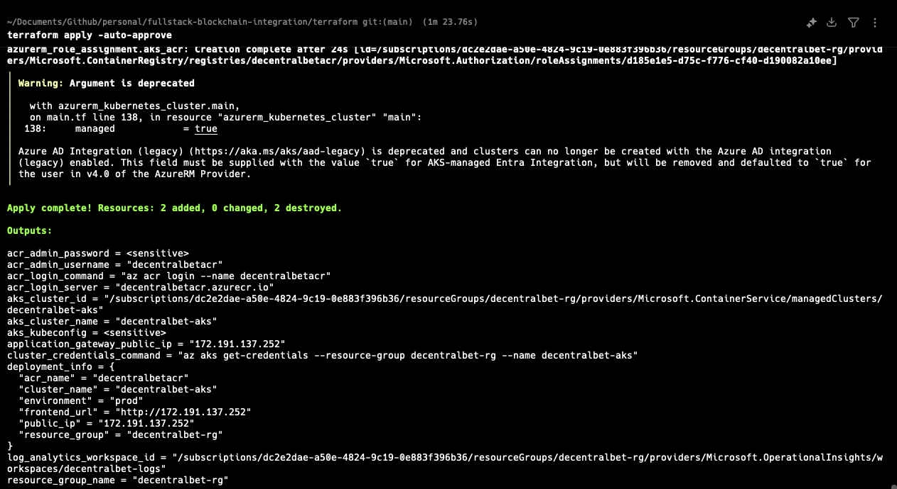

# Deployment Snapshots and Links

This document contains all required screenshots and links for deployment evidence and grading.

## Live Deployment Links

- Live Application: <http://20.232.231.105>
- Backend API Info: <http://20.232.231.105/api/v1/info>
- Demo Video: <https://x.com/i/status/1964571151847526577>

## Screenshots

1. Terraform Infrastructure Deployment
   

2. CI/CD Pipeline Success
   

3. AKS Cluster Deployment (Pods/Services/HPA)
   

4. Live Frontend Application
   

## Notes

- These snapshots demonstrate: Terraform deployment, CI/CD run, successful AKS rollout, and public frontend availability.
